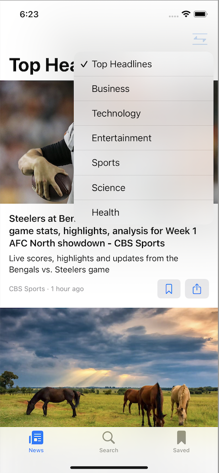
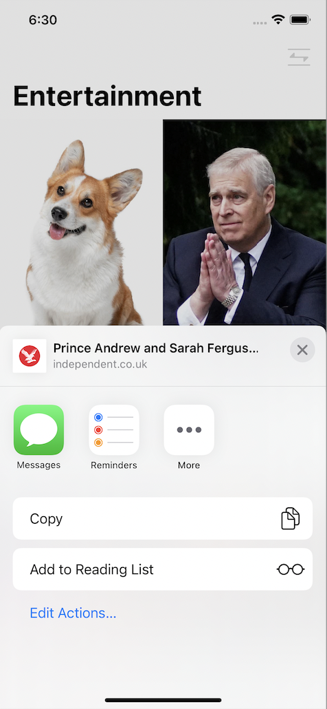
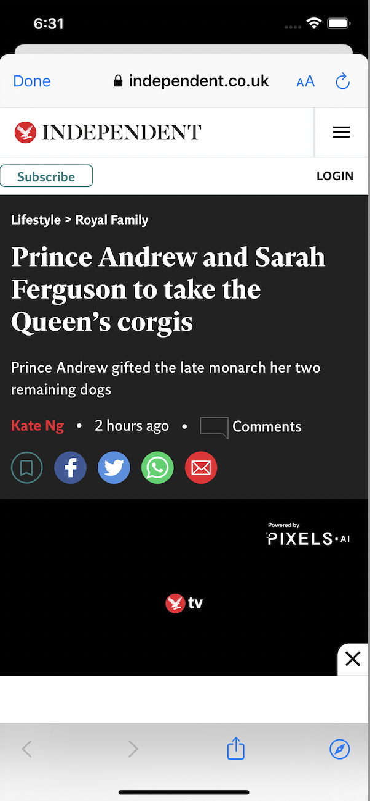
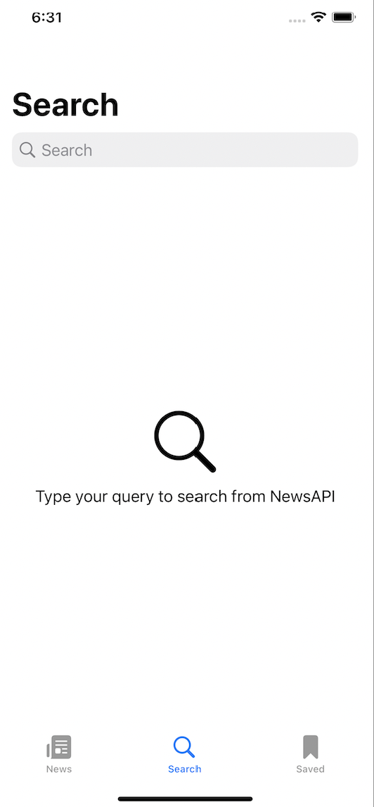
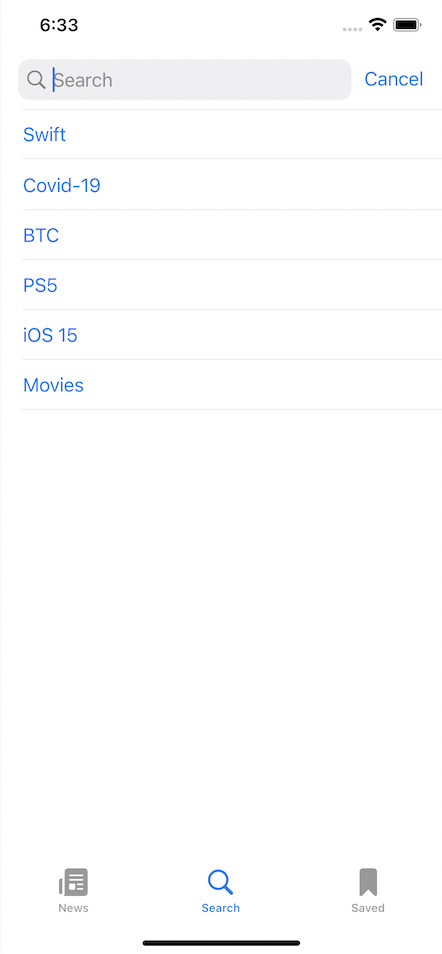

# NewsApp

## Project Overview
iOS multi-feature news application fetching the latest news from newsapi.org

## Features

### Categories
Search for categories including general, sports, entertainment, business, technology, science, and health  

### Bookmark
Option to bookmark and share news articles 

### Sharing
Option to share news articles 

### Safari WebView
Read articles within Safari WebView 

### Search
Ability to search for news articles. Search for categories, article names, date published, etc. 

### Search History
Presents a list of previously searched articles 

### Suggested Searches
Presents a list of suggested article searches 

